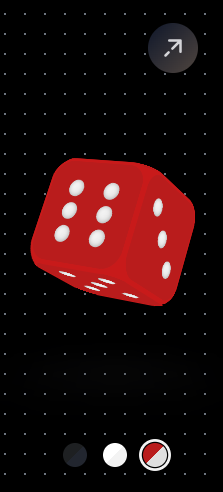

## 3D Interactive Dice Loader 🎲🔥



## 🤯 What Is This?
This is a **3D animated dice loader** built using **HTML, CSS, and JavaScript**. It has smooth animations, different themes, auto-rolling effects! Basically, this ain't your regular boring spinner, it's a whole vibe! 😎🔥

## 🚀 Features (What You Get?)
- 🎲 **3D Dice Animation** – Rolls like a real dice, but digitally cooler!
- 🎨 **Theme Switching (Dark, Light, Custom)** – Match your mood and flex your UI.
- ⏳ **Auto-Rolling Effect** – No need to roll manually, let it roll on its own!
- 📱 **Responsive Design** – Works on mobile, tablets, and even your grandpa's PC.
- 🖼️ **Preview Image Added** – Now, you get a sneak peek before you even open it.
- 🔥 **Favicon Support** – Look at that tiny icon in your browser tab. Pro-level stuff!
- 📜 **MIT License** – So you don’t get sued, and neither do I!
- 🌎 **Live Demo Available** – See it in action now! ⬇️

## 🌍 Live Preview (Go Check It Out!)
[Click Here to See Magic](https://3-d-interactive-dice-loader-developer-parths-projects.vercel.app/) 🚀

## 📂 Project Structure (Folder Breakdown)

| 📁 Folder/File | 📄 Description |
|--------------|---------------|
| 📄 [index.html](index.html) | Main HTML file (The Boss!) |
| 🎨 [style.css](style.css) | CSS for styling (Handles the visuals) |
| 🎮 [script.js](script.js) | JavaScript for logic (Brain of the project) |
| 📜 [README.md](README.md) | You’re reading it now, duh! |
| 🖼️ [preview.png](preview.png) | Screenshot preview (Flex time) |
| 🎭 [favicon.ico](favicon.ico) | Tiny but powerful branding |
| 📜 [LICENSE](LICENSE) | Legal stuff to keep things fair |

## 🔧 Installation (How to Get Started?)
```sh
git clone https://github.com/Developer-Parth/3D-Dice-Loader.git
cd 3D-Dice-Loader
```
Then, just open **index.html** in your browser, and BOOM! 🎇

## 🎨 Theme Options (Style It Your Way)

| 🎭 Theme  | 🎨 Colors |
|--------|--------------------------|
| 🌙 Dark   | `#1e2022`, `#22262f`  |
| ☀️ Light  | `#fff`, `#f3f3f3`  |
| 🎨 Custom | `#b91c1c`, `#e0e0e0`  |

## ⚙️ How Does It Work? (Brain Behind the Dice)
### 🔹 **1. 3D Dice Animation**
- Uses **CSS transforms** like `rotateX()` and `rotateY()` to spin the dice in a **random direction**.
- `setInterval()` ensures the dice moves **every second** with new random angles.
- CSS transitions make everything **smooth as butter**! 🧈

### 🔹 **2. Theme Switching**
- A **toggle button** lets you **switch between Dark, Light, and Custom themes**.
- JavaScript `body.classList.toggle()` dynamically applies the new theme.
- One click = instant **vibe switch**! 🔄✨

### 🔹 **3. Auto-Roll Effect**
- The dice rolls **automatically every few seconds**.
- Uses **Math.random()** to generate a **new angle each time**.
- `rotateX()` and `rotateY()` apply these random angles to create a realistic rolling effect.

## 🖥️ Technologies Used (What Powers This Beast?)
- **HTML5** 🏗️ – The skeleton.
- **CSS3** 🎨 – The glow-up.
- **Vanilla JavaScript** ⚡ – The real magic.

## 📜 License (Do Whatever, But Give Credit)
This project is under **MIT License**. That means you can use it freely, but don’t act like you coded it from scratch. 😎

## 📩 Contact Me (Want to Talk? Hit Me Up!)
If you have any doubts, suggestions, or just want to praise my genius 😏, you can **[click here](mailto:parththukral16@gmail.com)** to email me. 📧🔥

---
Developed with **🔥 and ☕ by Parth Thukral** 🚀

